# Mermaid Diagrams for 5G Scheduler Simulation Presentation

This document contains Mermaid code for generating flow diagrams, sequence diagrams, and architecture diagrams for presentation materials.

---

## 1. Overall System Architecture

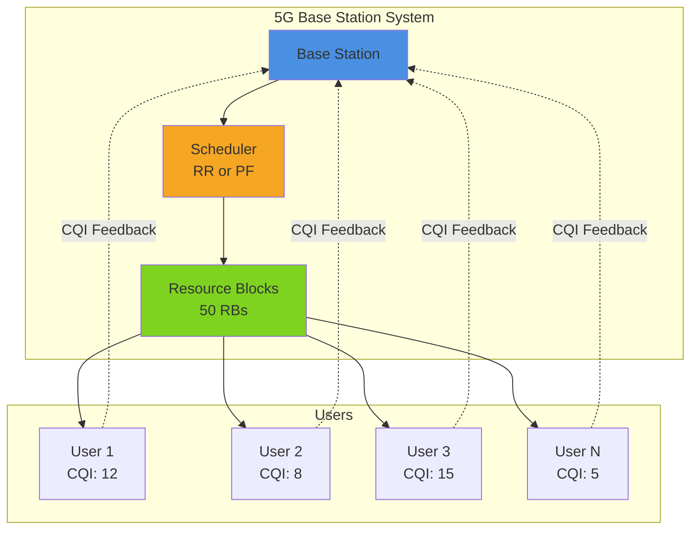

---

## 2. Simulation Methodology Flow

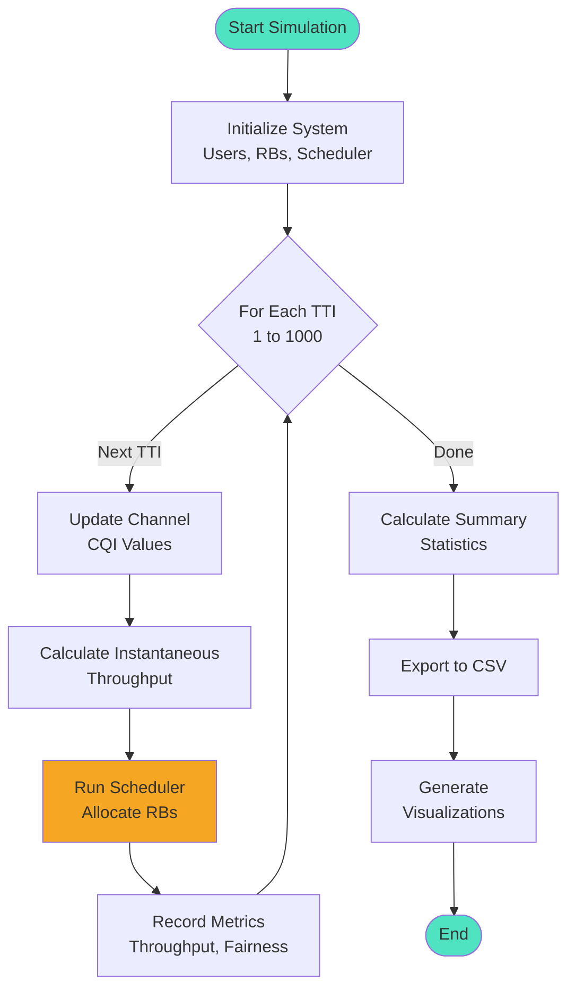

---

## 3. Round Robin Scheduler Flow

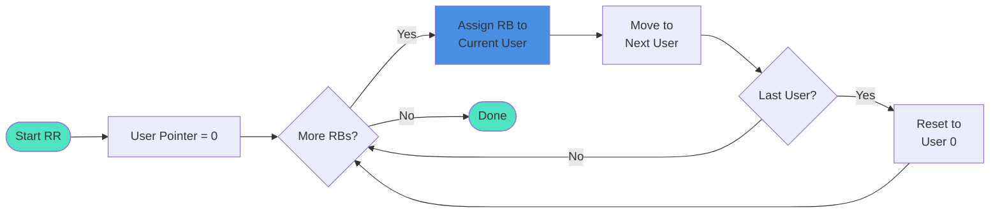

---

## 4. Proportional Fair Scheduler Flow

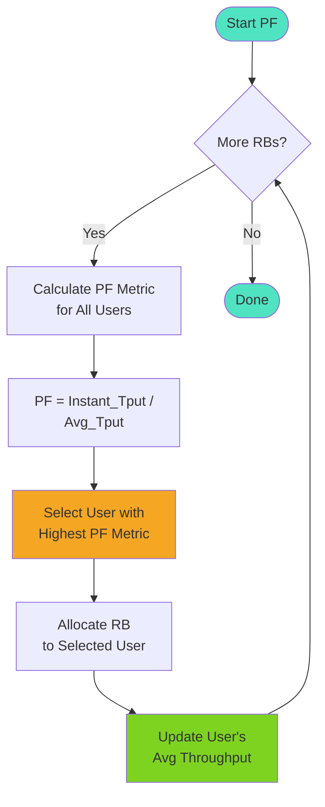

---

## 5. TTI Execution Sequence

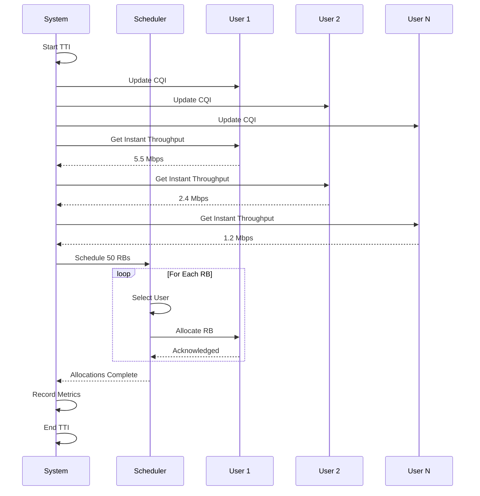

---

## 6. Round Robin vs Proportional Fair Comparison

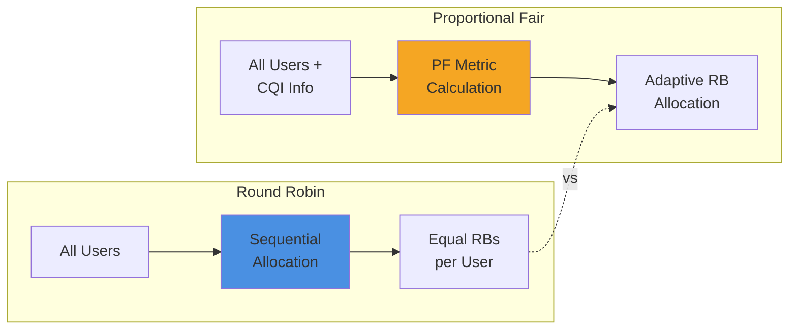

---

## 7. CQI to Throughput Mapping

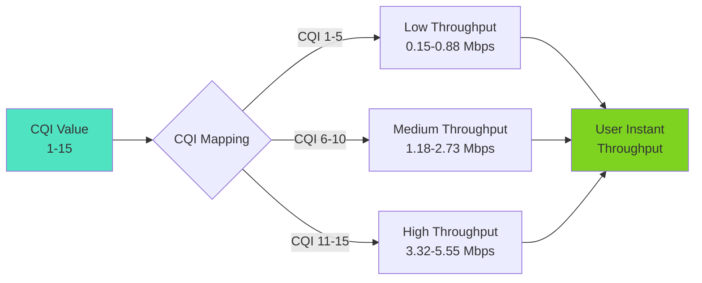

---

## 8. Metrics Calculation Flow

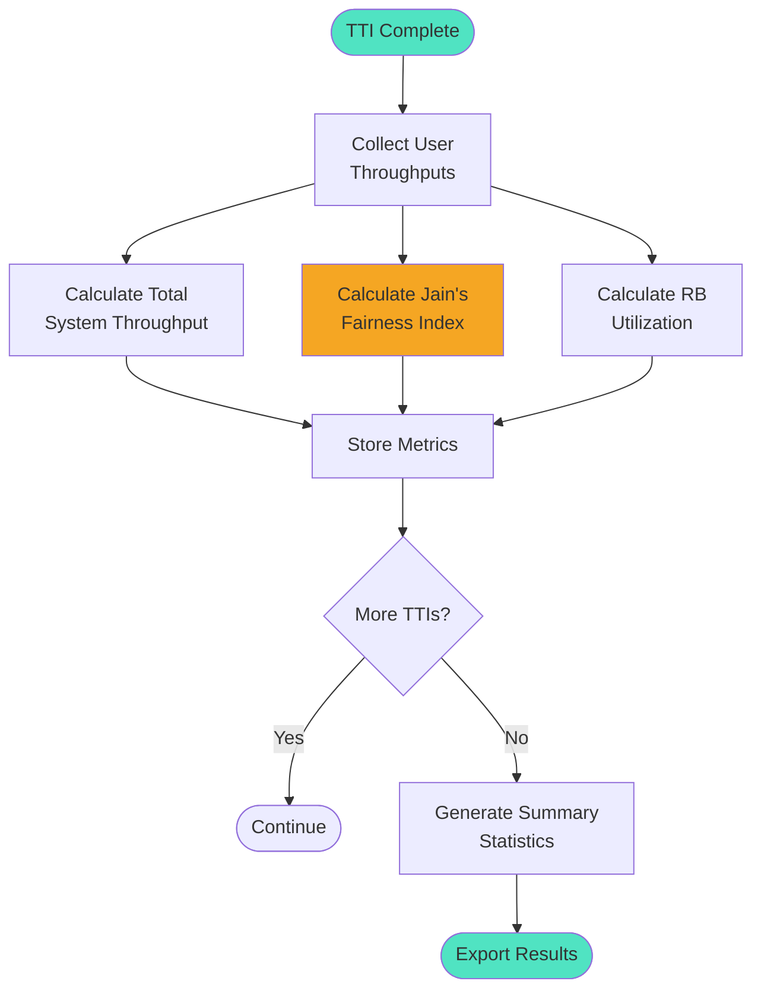

---

## 9. PF Metric Calculation Detail

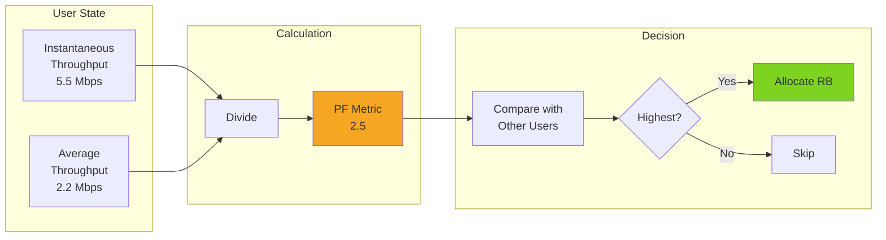

---

## 10. Data Export and Visualization Pipeline

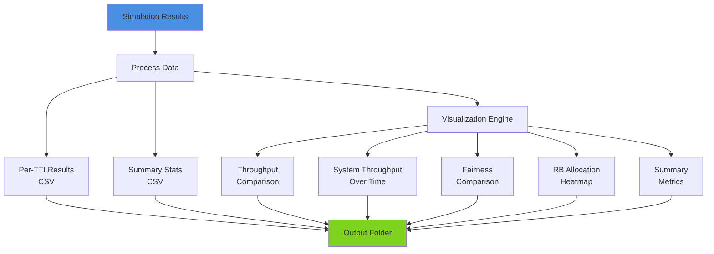

---

## 11. Class Diagram

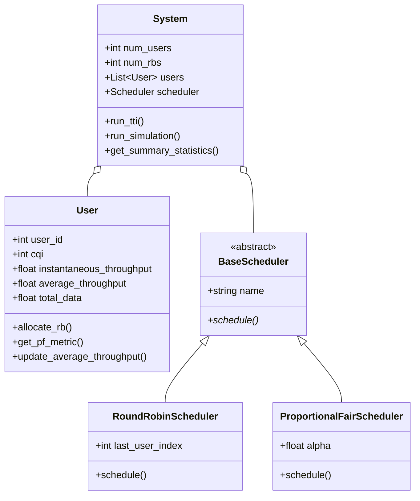

---

## 12. Fairness vs Throughput Trade-off

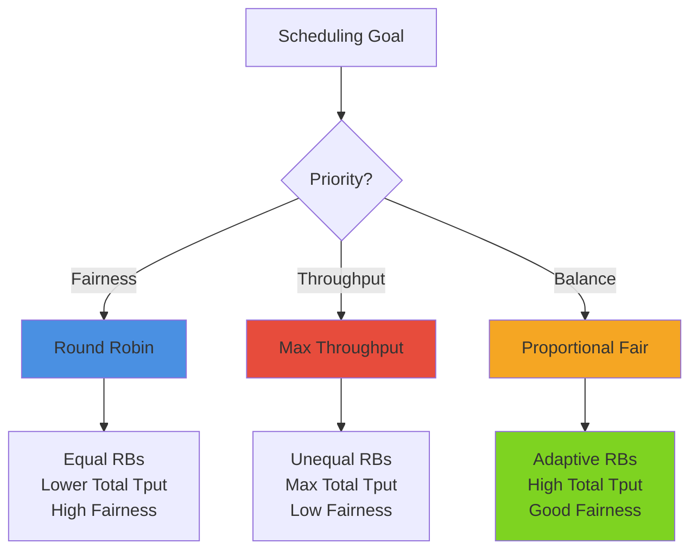

---

## Usage Instructions

To use these diagrams in presentations:

1. **Online Editors:**
   - Copy the code blocks to https://mermaid.live/
   - Export as PNG or SVG

2. **Markdown Renderers:**
   - GitHub, GitLab, and many markdown editors support Mermaid natively
   - Just paste the code blocks in your markdown files

3. **PowerPoint/Google Slides:**
   - Generate images from mermaid.live
   - Insert as images in your presentation

4. **Documentation:**
   - Use in README.md, technical docs, or wiki pages
   - Most modern platforms render Mermaid automatically

---

## Customization Tips

- Change colors: Add `style NodeName fill:#HEXCOLOR`
- Adjust layout: Modify `TB` (top-bottom), `LR` (left-right), `TD` (top-down)
- Add notes: Use `note right of NodeName: Your note`
- Simplify: Remove nodes or connections for simpler diagrams
- Combine: Merge multiple diagrams for comprehensive views

---
